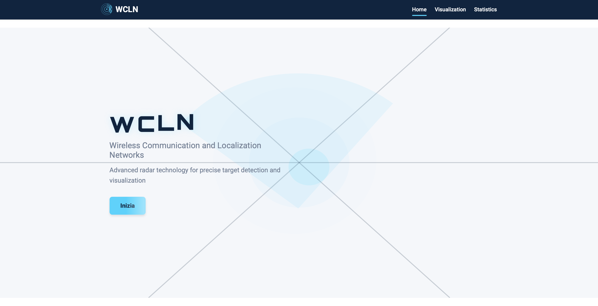
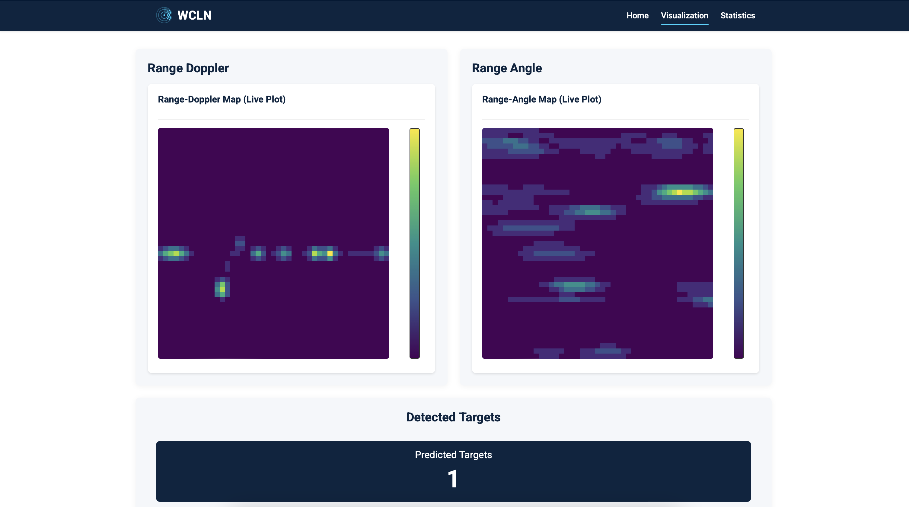
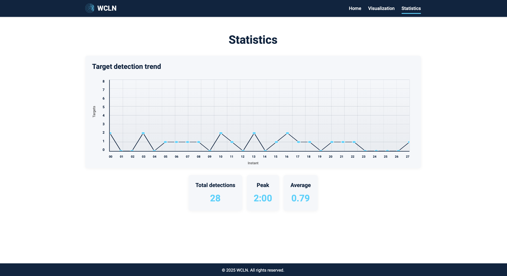

# Radar Target Counting System

Real-time radar target counting system using Python/TensorFlow Lite CNN for inference, RabbitMQ messaging for data streaming, and Angular/TypeScript GUI for Range-Doppler and Range-Angle visualization.




## 🔎 [Read the Full Thesis (PDF)](Thesis.pdf)

## Overview

This project implements an intelligent radar signal processing system that:

- Acquires and processes real-time radar data (Range-Doppler and Range-Angle maps)
- Uses a Convolutional Neural Network (CNN) implemented in TensorFlow Lite to count targets
- Streams data through RabbitMQ message broker for distributed processing
- Visualizes radar maps and target counts through an Angular-based web interface

## Project Structure

```
Counting_RD/
├── AI-Intelligence.py          # Main AI inference engine with TFLite CNN model
├── radar.py                    # Live radar data acquisition and streaming
├── producer.py                 # Simulated data producer (for testing with saved data)
├── Classes/                    # Utility classes
│   ├── FilesManager_class.py
│   └── RabbitMQ_class.py
├── GUI/                        # Web-based visualization interface
│   ├── frontend/               # Angular application
│   └── backend/                # Node.js/Express/TypeScript backend
├── Training/                   # Model training scripts and tools
│   ├── training.py
│   ├── Classes/
│   │   └── cnn_model.py
│   └── TFlite/
│       ├── convert_tflite.py
│       └── test-prediction-time.py
└── Trained-models/             # Pre-trained TensorFlow Lite models
    └── CNN_model_counting_3targets_2025-08-01_14-34-58-539201-tflite
```

## Technology Stack

- **Backend Processing**: Python 3.x
- **Machine Learning**: TensorFlow Lite (CNN for target counting)
- **Message Broker**: RabbitMQ
- **GUI Backend**: Node.js, Express, TypeScript
- **GUI Frontend**: Angular 16, Plotly.js, Chart.js
- **Data Communication**: Socket programming, RabbitMQ

## Prerequisites

### System Requirements

- Python 3.8+
- Node.js 16+ and npm
- RabbitMQ server
- Angular CLI

### Python Dependencies

```bash
pip install tensorflow numpy pika dill
```

### RabbitMQ Setup

Install and start RabbitMQ server:

```bash
# Windows (using Chocolatey)
choco install rabbitmq

# Or download from: https://www.rabbitmq.com/download.html
# Start RabbitMQ service
```

### Global Node.js Tools

```bash
npm install -g @angular/cli
```

## Getting Started

### 1. Install Backend Dependencies

Navigate to the backend directory and install dependencies:

```bash
cd GUI/backend
npm install
```

### 2. Install Frontend Dependencies

Navigate to the frontend directory and install dependencies:

```bash
cd GUI/frontend
npm install
```

### 3. Configure Python Environment

Install required Python packages:

```bash
pip install tensorflow numpy pika dill
```

## Running the Application

The system consists of multiple components that need to be started in sequence:

### Step 1: Start RabbitMQ Server

Ensure RabbitMQ is running on `localhost:5672` with default credentials (`guest/guest`).

### Step 2: Start the AI Intelligence Engine

This component receives radar data, performs CNN inference, and serves results via socket servers:

```bash
python AI-Intelligence.py
```

The AI engine will:

- Listen for radar data on RabbitMQ exchange `GUI_counting`
- Run TensorFlow Lite CNN inference for target counting
- Serve processed data on ports 11111 (RD), 22222 (RA), 33333 (Counting), 44444 (Chart)

### Step 3: Start Data Acquisition

**Option A: Live Radar Data** (requires physical radar hardware)

```bash
python radar.py
```

**Option B: Simulated Data** (uses saved radar measurements)

```bash
python producer.py
```

> **Note**: You can run **either** `radar.py` OR `producer.py`, depending on whether you have access to physical radar hardware or want to use pre-recorded data for testing.

### Step 4: Start the Backend Server

In a new terminal:

```bash
cd GUI/backend
npm run dev
```

The backend will start on `http://localhost:3000` and serve as a bridge between Python scripts and the Angular frontend.

### Step 5: Start the Frontend Application

In a new terminal:

```bash
cd GUI/frontend
npm start
```

The Angular development server will start on `http://localhost:4200`. Open your browser and navigate to this URL to access the GUI.

## GUI Features

The web interface provides:

- **Real-time Range-Doppler Map Visualization**: Interactive heatmaps showing radar returns
- **Range-Angle Map Display**: Spatial distribution of detected targets
- **Target Counter**: Live count of detected targets using CNN inference
- **Statistics Dashboard**: Historical data and performance metrics
- **Interactive Charts**: Target count trends over time

## 📡 System Architecture

```
┌─────────────┐         ┌──────────────┐         ┌─────────────────┐
│  Radar HW   │ ──────> │  RabbitMQ    │ ──────> │ AI-Intelligence │
│ (radar.py)  │         │   Broker     │         │  (CNN Inference)│
└─────────────┘         └──────────────┘         └─────────────────┘
                                                          │
      OR                                                  │ Socket Servers
                                                          │ (ports 11111-44444)
┌─────────────┐                                          ▼
│  Producer   │                                  ┌─────────────────┐
│(producer.py)│                                  │  Backend Server │
└─────────────┘                                  │  (Express/TS)   │
                                                 └─────────────────┘
                                                          │
                                                          │ REST API
                                                          ▼
                                                 ┌─────────────────┐
                                                 │ Angular Frontend│
                                                 │   (GUI/Charts)  │
                                                 └─────────────────┘
```

## Model Training

To train a new CNN model:

```bash
cd Training
python training.py
```

To convert trained models to TensorFlow Lite format:

```bash
cd Training/TFlite
python convert_tflite.py
```

## Configuration

### RabbitMQ Connection Settings

Default settings (can be modified in Python scripts):

- **Host**: `localhost`
- **Port**: `5672`
- **Username**: `guest`
- **Password**: `guest`
- **Exchange**: `GUI_counting`

### Socket Server Ports

- **11111**: Range-Doppler data
- **22222**: Range-Angle data
- **33333**: Target counting data
- **44444**: Chart data

## Development

### Building for Production

**Backend:**

```bash
cd GUI/backend
npm run build
npm start
```

**Frontend:**

```bash
cd GUI/frontend
npm run build
```

## About This Project

This project was developed as part of my master's thesis at the **WCLN (Wireless Communication and Localization Networks Laboratory)** at the University of Ferrara. The research focuses on applying deep learning techniques to radar signal processing for real-time target counting and classification.

## License

This project was developed for academic research purposes as part of a bachelor's thesis at the University of Ferrara.
Feel free to use and adapt this code for your own research and educational purposes.

---

**Note**: This system requires properly configured radar hardware for live operation. For testing purposes, use `producer.py` with pre-recorded radar data samples.
